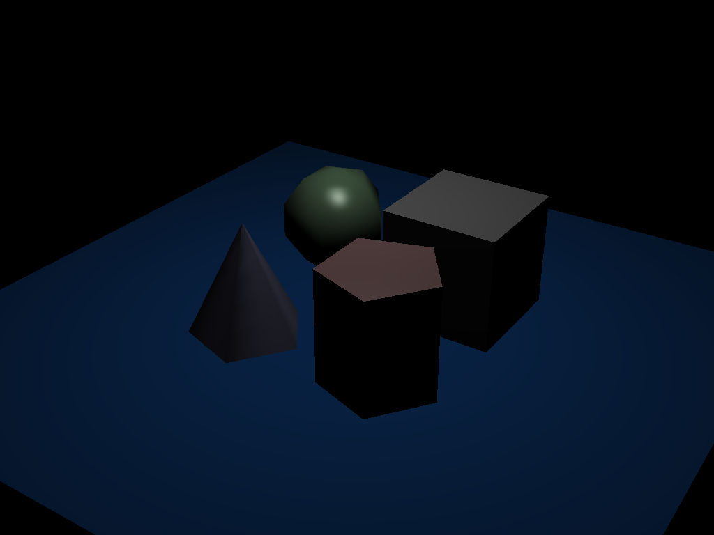
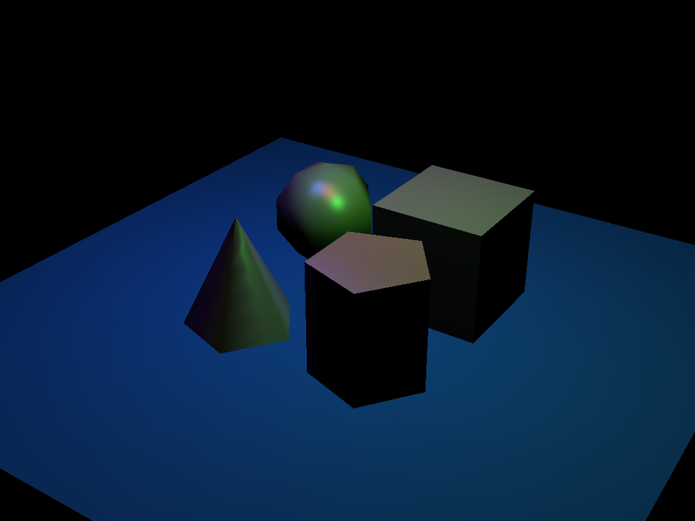
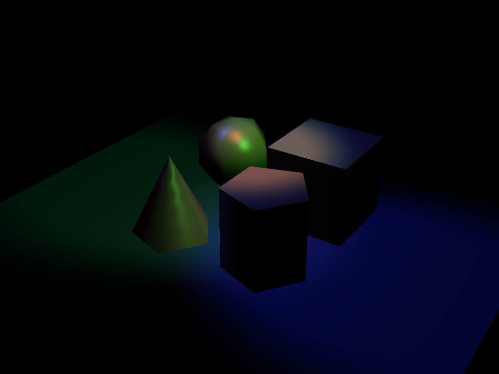
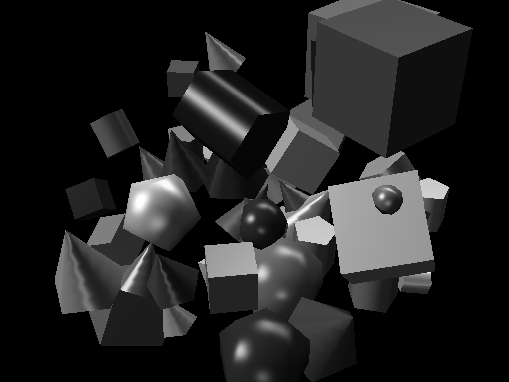
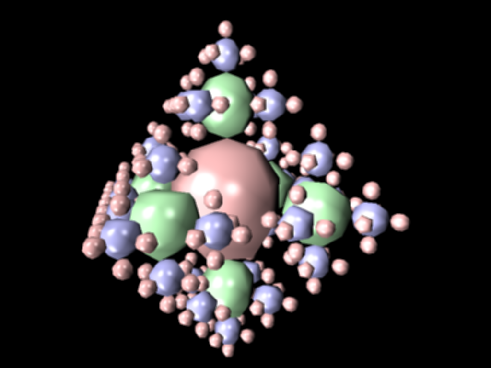

## Project 6: Action!

Please fill this out for Action! only. The project handout can be found [here](https://cs1230.graphics/projects/realtime/2).

### Output Comparison

> [!IMPORTANT]
> Before generating expected outputs, make sure to:
>
> 1. Set your working directory to the project directory
> 2. From the project directory, run `git submodule update --recursive --remote` to update the `scenefiles` submodule.
> 3. Change all instances of `"lights-camera"` in `mainwindow.cpp` to `"action"` (there should be 2 instances, one in `MainWindow::onUploadFile` and one in `MainWindow::onSaveImage`).

Run the program, open the specified `.json` file and follow the instructions to set the parameters.

If the output you are generating is an image, save the image with the specified file name using the "Save image" button in the UI. Be sure to follow the instructions in the left column to set the file name. Once you save the images, they will appear in the table below.

If the output you are generating is a video, reference the [Screen Recording Guide](https://cs1230.graphics/docs/screen-recording) to capture a video of the specified interaction. Once you've recorded everything, navigate to this template file in Github, click edit, and either select or drag-and-drop each of your videos into the correct location. This will upload them to GitHub (but not include them in the repo) and automatically embed them into this Markdown file by providing a link. Make sure to double-check that they all show up properly in the preview.

We're **not** looking for your video to **exactly** match the expected output (i.e. draw the exact same shape). Just make sure to follow the instructions and verify that the recording fully demonstrates the functionality of that part of your project.

> [!NOTE]
> There may be issues with the image saving functionality, and the images may not save the exact same way as the expected outputs. This is acceptable, as long as your output demonstrates correct functionality.

#### Point and Spot Lights

|                                File/Method To Produce Output                                 |                                                Expected Output                                                 |                                                       Your Output                                                       |
| :------------------------------------------------------------------------------------------: | :------------------------------------------------------------------------------------------------------------: | :---------------------------------------------------------------------------------------------------------------------: |
| Input: `point_light_1.json` Output: `point_light_1.png` Parameters: (5, 5, 0.1, 100) |  |  |
| Input: `point_light_2.json` Output: `point_light_2.png` Parameters: (5, 5, 0.1, 100) |  |  |
| Input: `spot_light_1.json` Output: `spot_light_1.png`  Parameters: (5, 5, 0.1, 100)  |   |    |
|  Input: `spot_light_2.json` Output: `spot_light_2.png` Parameters: (5, 5, 0.1, 100)  |   |    |

#### Invert

I did not implement an invert functionality, so this is omitted.

#### Grayscale

> [!NOTE]
> If you did not implement the grayscale filter, you can skip this section.

|                                                         File/Method To Produce Output                                                         |                                                       Expected Output                                                        |                                                                     Your Output                                                                     |
| :-------------------------------------------------------------------------------------------------------------------------------------------: | :--------------------------------------------------------------------------------------------------------------------------: | :-------------------------------------------------------------------------------------------------------------------------------------------------: |
| Input: `primitive_salad_1.json` **Apply grayscale filter** Output: `primitive_salad_1_grayscale.png` Parameters: (5, 5, 0.1, 100) |  |  |

> [!WARNING]
> Kernel-based filters might not work the same on different devices. This is explained in more detail in the project handout. If your output doesn't seem to quite match our output but you think your implementation is correct, be sure to let your mentor know.

#### Sharpen

I did not implement sharpen functionality, so this is omitted.

#### Blur

> [!NOTE]
> If you did not implement the blur filter, you can skip this section.

|                                                     File/Method To Produce Output                                                     |                                                     Expected Output                                                      |                                                                 Your Output                                                                 |
| :-----------------------------------------------------------------------------------------------------------------------------------: | :----------------------------------------------------------------------------------------------------------------------: | :-----------------------------------------------------------------------------------------------------------------------------------------: |
| Input: `recursive_sphere_4.json` **Apply blur filter** Output: `recursive_sphere_4_blur.png` Parameters: (5, 5, 0.1, 100) |  |  |

#### Camera Translation

_Instructions:_ Load `chess.json`. For about 1 second each in this order, press:

- <kbd>W</kbd>, <kbd>A</kbd>, <kbd>S</kbd>, <kbd>D</kbd> to move in each direction by itself
- <kbd>W+A</kbd> to move diagonally forward and to the left
- <kbd>S+D</kbd> to move diagonally backward and to the right
- <kbd>Space</kbd> to move up
- <kbd>Cmd/Ctrl</kbd> to move down

##### Expected Output

https://github.com/BrownCSCI1230/projects_realtime_template/assets/45575415/710ff8b4-6db4-445b-811d-f6c838741e67

##### Your Output

<!---
Paste your output on top of this comment!
-->

#### Camera Rotation

_Instructions:_ Load `chess.json`. Take a look around!

##### Expected Output

https://github.com/BrownCSCI1230/projects_realtime_template/assets/45575415/a14f4d32-88ee-4f5f-9843-74dd5c89b9dd

##### Your Output

<!---
Paste your output on top of this comment!
-->

### Design Choices

This project directly builds on the functionality already implemented for the Lights, Camera project. Much of the overall code structure is preserved, with the new features of Action being integrated into existing components.

Spot lights and point lights had a single point of modification. My scene loader from Lights, Camera would already load the appropriate data for spot and point lights and send it to the shader for rendering. The only piece of code that needed modification was the fragmetn shader itself for computing lighting using these different light types. I created two new functions: one to compute lighting from spot lights, and one to compute lighting from point lights. These were integrated into existing shader code to handle new lighting.

Camera movement made use of my existing methods for my camera object (namely getters and setters for camera metadata, as well as helpers to regenerate the view matrix). Since translation and rotation comprise the view matrix, and the user can change the camera's angle (rotation) and position (translation) separately, I stored the translation and rotation matrix components of the camera separately. Changing the position of the camera would change the stored translation matrix, which would rebuild the view matrix using the cached rotation matrix (to avoid needing to rebuild the rotation matrix using the same rotation data). Rotations were implemented using quaternions (very cool). The same is true for the camera rotation and rotation matrix. The code that updated the fields of the camera were inserted into the relevant Realtime methods.

The last feature I implemented was post-processing effects via framebuffers. This involved some additional helper functions to generate framebuffers, almost directly ported from Lab 11. The existing `paintGL` code was moved to paint into a framebuffer. I created additional shader programs to apply post processing effects depending on runtime settings. I developed grayscale conversion and blur filters. There isn't much more to describe since I basically just ported over Lab 11 to this project.

### Collaboration/References

Praise be to the word of God (Daniel Richie's glorious lectures), which provided the necessary background required to implement this project.

### Known Bugs

No known bugs.

### Extra Credit

None attempted.